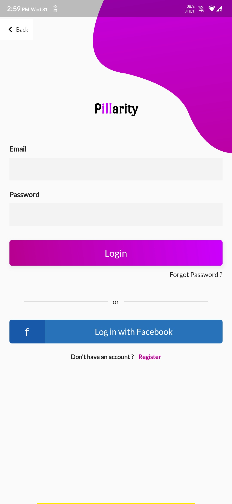

# Pillarity :pill:

An application for medicine and blood donation

## Description :shipit:

Pillarity aims to help people with low income to search
for and get the medicine they need by posting a request for this medicine.

Donors can respond to the requests by providing the medicine needed (either a non-expired high-quality left-over or a brand new medicine), contributing by a finite amount of money to buy the medicine, or contributing in delivring the medicine to the one in need.

At each stage of the medicines' trip from the donor to the recipient, a bar-code needs to be scanned to determine where the medicines are at any given time.

The application also offers a way to donate blood, where users enter their blood type, age, sex, and location, based on this data, users get notified when others ask for blood donation near them, thus making a quicker impact.

## Internals :arrow_down_small:

