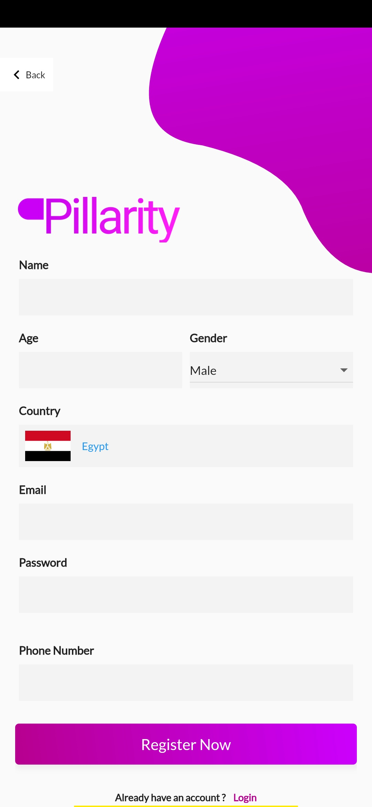
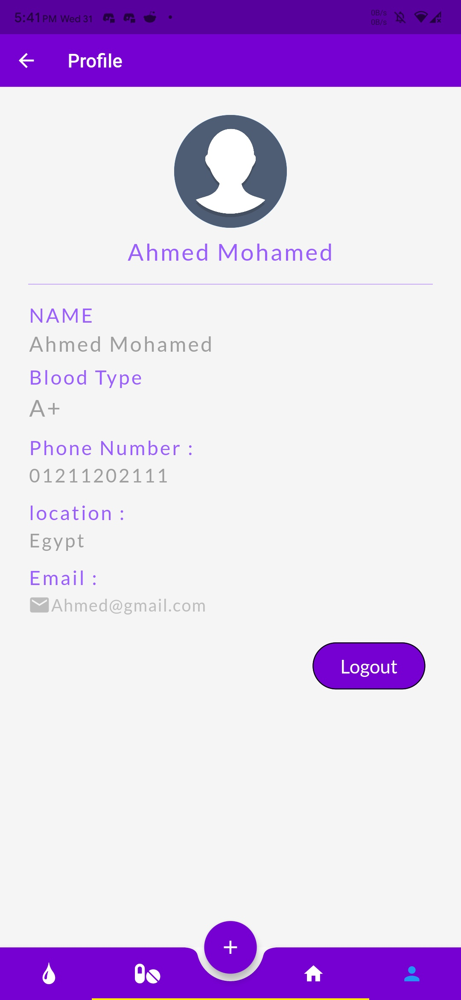
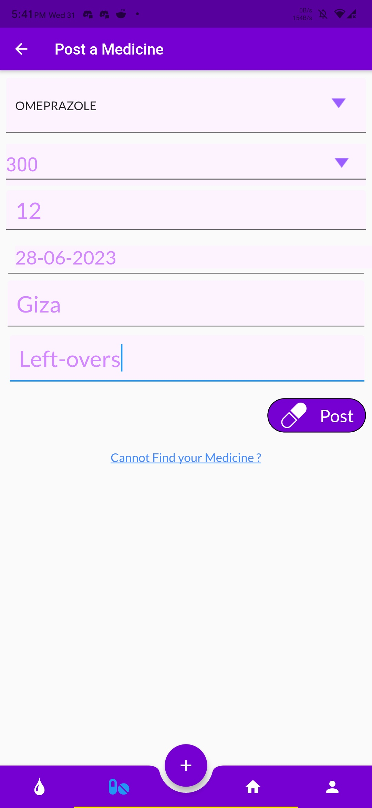
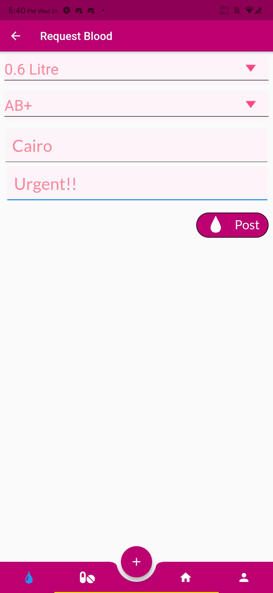

<hr>

# Pillarity :pill:

An application for Medicine and Blood donation

## Description :shipit:

Pillarity aims to help people with low income to search
for and get the medicine they need by posting a request for this medicine.

Donors can respond to the requests by providing the medicine needed (either a non-expired high-quality left-over or a brand new medicine), contributing by a finite amount of money to buy the medicine, or contributing in delivring the medicine to the one in need.

At each stage of the medicines' trip from the donor to the recipient, a bar-code needs to be scanned to determine where the medicines are at any given time.

-The application also offers a way to donate blood, where users enter their blood type, age, sex, and location, based on this data, users get notified when others ask for blood donation near them, thus making a quicker impact.

## Internals :arrow_down_small:
<div style="display:flex">
<div>

### Login page:

<hr>
</div>
<div>

### Registration page:

<hr>
</div>
<div>

### Profile:

<hr>
</div>
<div>

### Feed:

<hr>
</div>
<div>

### Medicine Donation Post:

<hr>
</div>
<div>

### Medicine Request:

<hr>
</div>
<div>

### Blood Request:

<hr>
</div>
</div>


## Tech :gear:

Pillarity uses a number of open source projects to work properly:

- [Flutter](https://flutter.dev/docs)  - Flutter for application interface
- [Dart](https://dart.dev/guides) - Dart 
- [FireBase](https://firebase.google.com/) - FireBase for Authentication and Database 
- [Sqflite](https://pub.dev/packages/sqflite) - Sqflite for DataBase

## Installation :sparkler:

Pillarity requires [flutter](https://flutter.dev/docs) v2.1.0 to run.

Install the dependencies and devDependencies and start the server.

```sh
C:\src>git clone https://github.com/flutter/flutter.git -b stable
C:\src\flutter>flutter doctor
```

For production environments...

```sh
/path-to-flutter-sdk/bin/flutter
/path-to-flutter-sdk/bin/dart
```
## License :scroll:

> This Software is licensed under MIT License, See [License](./LICENSE) for more information ©Pillarity
